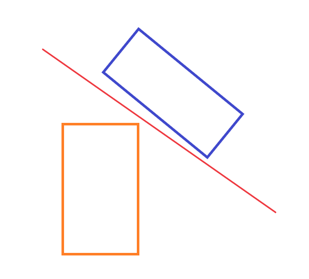
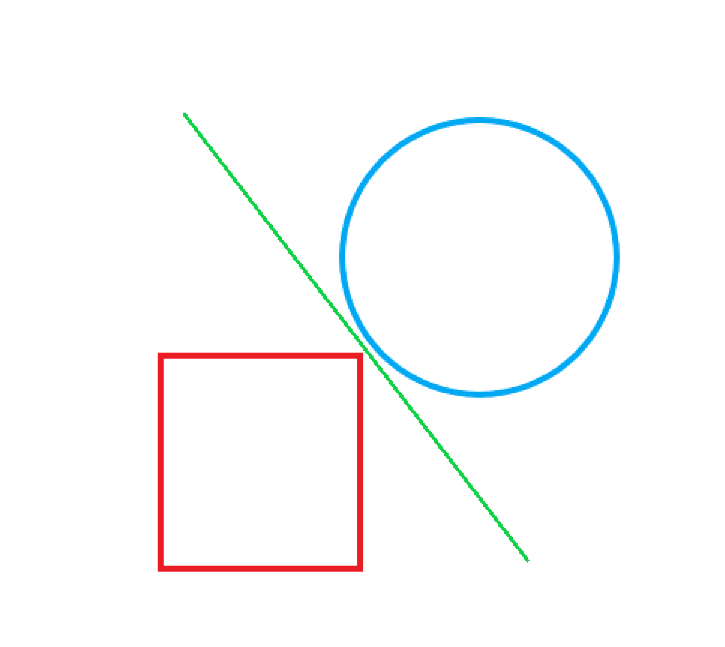
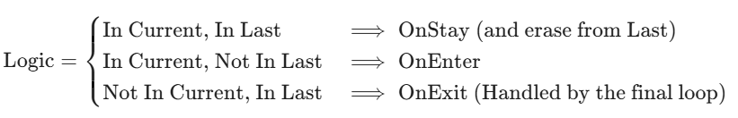
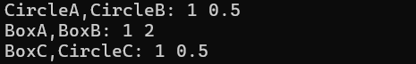
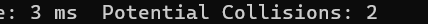
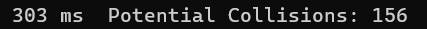
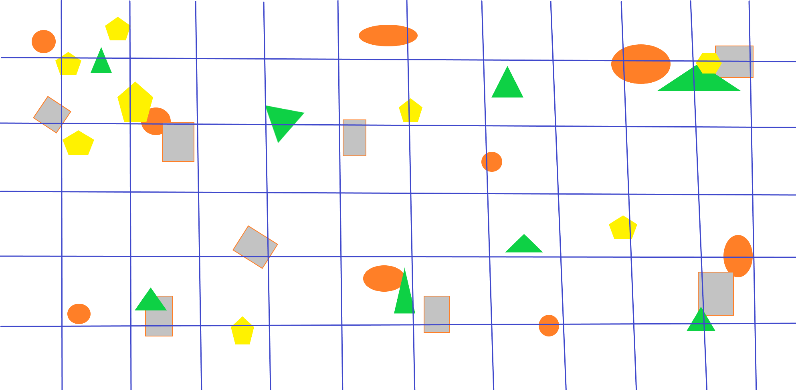
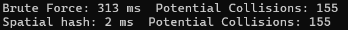
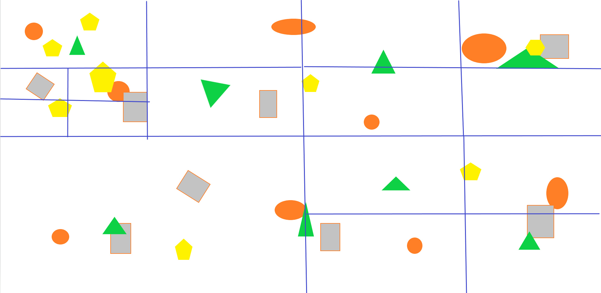
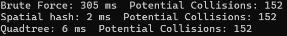

+++
date = '2025-12-19T21:41:50-05:00'
draft = false
title = '2D Engine Collision System'

+++

This blog aim to describe how to write a Collision System using c++. It's not the very advanced industry solution. Only use it to learn the basic idea and try to uncover the logic.

---

## 0. Before Start

Before started, at least we need to have the base of the Engine setup. 

In the Engine::Initialize(), we have every subsystem::Initialize() which will be call at the start of the main.

```c++
void Engine::Initialize()
{
    Engine_Register();

	Time::Instance().Initialize();
    RenderSystem::Instance().Initialize();
    InputManager::Instance().Initialize();
    CollisionSystem::Instance().Initialize();
    AssetManager::Instance().Initialize();
    SceneManager::Instance().Initialize();
}
```

The Engine::GameLoop() will update every subsystem if needed. IMPORTANT, the order matters. I will explain it in the Workflow part.

```c++
void Engine::GameLoop()
{
	while (!quit)
	{
		Time::Instance().Update();
        InputManager::Instance().Update();
        SceneManager::Instance().Update();
        CollisionSystem::Instance().Update();
        RenderSystem::Instance().Update();

	}
}
```

Of course we have the Engine::Destroy(), which will be called by the end of the program.

```c++
void Engine::Destroy()
{
    RenderSystem::Instance().Destroy();
    CollisionSystem::Instance().Destroy();
    SceneManager::Instance().Destroy();
    AssetManager::Instance().Destroy();
}
```

Also, the whole system are using ECS design(Entity-Component-System), so we have the set-up of Entity and Component. Both of them derived from Object.

```c++
class Object
{
public:
	virtual void Initialize();
	virtual void Destroy();
	virtual void Load(json::JSON& jsonData);
	bool IsInitialized() { return initialized; }
	STRCODE GetId() { return uid; }
	void SetId(int _uid) { uid = _uid; }
    
private:
	bool initialized = false;
	STRCODE uid = -1;
	std::string guid;

};
```

```c++
class Entity: public Object
{
    //Hide some unimportant codes
public:
	void Initialize() override;
	void Update();
    
	Component* CreateComponent(const std::string& componentType);
	bool RemoveComponent(Component* component);
	Component* const FindFirstComponentByType(const std::string& comp_type);
	std::vector<Component*> FindComponentsByType(const std::string& comp_type);
	Transform* GetTransform() const { return transform; }
    
private:
	std::list<Component*> components;
	Transform* transform = nullptr;

private:
	void Destroy() override;
	
};
```

```c++
class Component : public Object
{
public:
	void Initialize() override;
	void Load(json::JSON& jsonData) override;
	Entity* GetOwner() const { return owner; }
    
protected:
	void Destroy() override;
	virtual void Update() {};
    
private:
	Entity* owner = nullptr;
};
```

---

## 1. Build the system

The Collision system is the a subsystem of the engine and I made it to a singleton for anywhere we need to do some detection. It will store everything that need to calculate collision. So how can we know "what" needs collision? Is every entity needed to be include? Because of the ECS, we can make it to a component. It gives us the flexibility for adding or deleting collision from entities. So now, we have the Collider!:smiley::smiley::smiley:

```c++
class Collider : public Component
{
public:
	void Initialize() override;
	void Destroy() override;

	virtual ColliderType GetType() const = 0;
	virtual void Load(json::JSON& _jsonData) override;
};
```

Besides, we have two classes derived from it: BoxCollider and CircleCollider. Actually, we cannot new a collider. At least it should have a shape.

```c++
class BoxCollider:public Collider
{
public:
	ColliderType GetType() const override { return ColliderType::Box; }

	void Initialize() override;
	void Destroy() override;
	void Load(json::JSON& _jsonData) override;
};//The same as CircleCollider.
```

So in the collision system, we need to maintain the list of colliders(std::vector literally). In the Collider constructor or Initialize, it should add itself to the Collision system. Also, there are some functions for others who want to check collision individually.

```c++
class CollisionSystem final
{
    DECLARE_SINGLETON(CollisionSystem)
        
public:
	bool CheckPoint(SDL_Point pos);
	bool CheckPoint(SDL_Point pos, Entity* outEntity);
	bool CheckCollision(Entity* e);
	bool CheckCollision(Collider* c);
	bool CheckCollision(Entity* a, Entity* b);
	bool CheckCollision(Collider* c, Entity* e);

	void AddCollider(Collider* c) { colliders.push_back(c); }
	void RemoveCollider(Collider* c){ colliders.erase(std::remove(colliders.begin(), colliders.end(), c), colliders.end());}
	const std::vector<Collider*>& GetColliders() const { return colliders; }
    
private:
	void Initialize();
	void Update();
	void Destroy();

	CollisionInfo CheckCollision(Collider* a, Collider* b);
    
private:
	std::vector<Collider*> colliders;
};
```

Congratulations:relaxed::relaxed::relaxed: We have the basic systems! 

Next, we need to dive into the system and find out how it works.

---

## 2. Workflow

Okey, let's jump back to the order of the update. 

Why it must keep such an order? Imagine there is a Actor. It will receive the player input, move, and hit a wall. The first subsystem should always be the Time. It will update the engine time for every subsystem. Next is the Input system. When player input are detected, the callback will be invoked try to move the actor. Then the Scene Manager will update the position of the actor. After that, it turns to the Collision system. It will check if it collide with others. If not, awesome! But if it do have collision, we need to fix it. We need to pull back the actor, change it to the right place without collision. So it will be the final position of the actor FOR THIS FRAME. Finally, the render system will render it to the screen and everyone will be satisfied. 

So, the order will be like this:

```c++
Time->InputManager->SceneManager->CollisionSystem->RenderSystem
```

Back to the Collision system, we should have Detect() which will check every colliders' collision and Resolve() which will fix all the collision to the right position. Additionally, we should add some callbacks. Therefore the user can have the abilities to do something when collision happens. 

SO we need to add something in the Collider:

```c++
//On collision event callbacks
std::function<void(Collider*)> onEnter;
std::function<void(Collider*)> onStay;
std::function<void(Collider*)> onExit;
```

And in the CollisionSystem:

```c++
void CollisionSystem::Update()
{
	Detect();
	FireEvents();
	Resolve();
}
```

Now let me describe them one by one.

---

## 3. Detect

First and the most important part is the Detect. It will decide how well is the system.

For the flexible and readable, I put all math stuffs in the new namespace called CollisionMath. In the Collision system we only need to call the functions to calculate everything for us.

```c++
namespace CollisionMath
{
    //TBD
}
```

### AABB - Axis-Aligned Bounding Box

When we talk about collision detection, the easiest way will always be AABB checking. They only need to check the x axis and y axis:

```c++
bool CollisionMath::CheckAABBOverlap(AABB a, AABB b)
{
	if (b.min.x >= a.max.x || a.min.x >= b.max.x || b.min.y >= a.max.y || a.min.y >= b.max.y)
	{
		return false;
	}
	return true;
}
```

The AABB struct only need to store two vector2: the min point and the max point of the bounding box.

```c++
struct AABB
{
	glm::vec2 min, max;
	AABB(){}
	AABB(glm::vec2 _min, glm::vec2 _max):min(_min),max(_max){}
};
```

Easy math. Easy struct. And it can work perfectly for boxes. But it do have some limitations. First it cannot handle the circle. Second it cannot detect correctly when the box is rotated. So we need to find some advanced algorithm. 

### SAT - Separating Axis Theorem

The idea is very easy that every one can understand: **if you are able to draw a line to separate two polygons, then they do not collide.**



It can handle all kind of **convex** shapes which is enough for our system.

So how to make computer understand the Theorem?

There is another words to describe SAT: **If two convex objects are not penetrating, there exists an axis for which the projection of the objects will not overlap.** And the axis will always be perpendicular to one of their edges. (It will be a little difference with the circle, i will mention that later). 

Then things become simple. We just need to get every edges, calculate the vertical line, get the projection of two shapes which will be a line, check if these two line overlapped. If they do, we move on to the next edge. If not, congratulations, they are not colliding. When we traverse all the edges and couldn't find a success, then they are colliding.


Before the SAT logic, we need some helper functions.

For Collider:

```c++
glm::vec2 center = { 0,0 };

glm::vec2 Collider::GetCenterWorld() const
{
    Transform* t = GetOwner()->GetTransform();
    glm::vec2 s = t->GetScale();
    float r = t->GetRotation();

    glm::vec2 c = GetCenter();
    glm::vec2 scaled = { (c.x * s.x), (c.y * s.y) };
    glm::vec2 rotated = {
        scaled.x * cos(r) - scaled.y * sin(r),
        scaled.x * sin(r) + scaled.y * cos(r)
    };

    return t->GetPosition() + rotated;
}
```

For BoxCollider:

```c++
std::vector<glm::vec2> vertices;
glm::vec2 size = { 1.0f, 1.0f };//width and height of the box

//Return the vertices data of a box collider in world coordinate.
//IMPORTANT:vertices must in order!
std::vector<glm::vec2> BoxCollider::GetVertices()
{
	glm::vec2 pos = GetOwner()->GetTransform()->GetPosition();
	float rot = GetOwner()->GetTransform()->GetRotation();
	glm::vec2 scale = GetOwner()->GetTransform()->GetScale();
    
	glm::vec2 hs = (size * scale) * 0.5f;
	std::vector<glm::vec2> corners = { {-hs.x, -hs.y},{ hs.x, -hs.y},{ hs.x,  hs.y},{-hs.x,  hs.y} };

	float c = cos(rot);
	float s = sin(rot);
	for (auto& point : corners)
	{
		glm::vec2 rotated{ point.x * c - point.y * s, point.x * s + point.y * c };
		point = pos + rotated;
	}
	vertices = corners;
	
	return vertices;
}
```

For CollisionMath:

```c++
glm::vec2 CollisionMath::VerticalLine(const glm::vec2& pointA, const glm::vec2& pointB)
{
	return{ -(pointB - pointA).y,(pointB - pointA).x };
}

void CollisionMath::Projection(const std::vector<glm::vec2> vertices, glm::vec2 line, float& outMin, float& outMax)
{
	if (vertices.size() <= 1)
		return;
	float resMin = dot(vertices[0], line);
	float resMax = resMin;

	for (auto v : vertices)
	{
		float res = dot(v, line);
		resMin = fmin(res, resMin);
		resMax = fmax(res, resMax);
	}
	outMax = resMax;
	outMin = resMin;
}

void CollisionMath::Projection(const glm::vec2 center, float radius, glm::vec2 line, float& outMin, float& outMax)
{
	float centerP = dot(center, line);
	outMin = centerP - radius;
	outMax = centerP + radius;
}
```

Additionally, if we want to resolve the collision, we also need to know how long is the penetration and the direction of it. So I create a struct to store the info:

``` 
struct CollisionInfo
{
	bool isOverlapping = false;
	glm::vec2 normal;
	float penetration = 1000000.0f;
};
```

Finally, let's take a look of the SAT:

```c++
CollisionMath::CollisionInfo CollisionMath::SAT_BoxBox(BoxCollider* a, BoxCollider* b)
{
	CollisionInfo info;
	std::vector<glm::vec2> verticesA = a->GetVertices();
	std::vector<glm::vec2> verticesB = b->GetVertices();

    //Traverse all edges for A
	for (int i = 0; i < verticesA.size(); i++)
	{
		glm::vec2 current = verticesA[i];
		glm::vec2 next = verticesA[(i + 1) % verticesA.size()];
		glm::vec2 v = normalize(VerticalLine(current, next));

		float minA, maxA, minB, maxB;
		Projection(verticesA, v, minA, maxA);//Calculate projection
		Projection(verticesB, v, minB, maxB);
		if (maxA <= minB || maxB <= minA)
		{
			info.isOverlapping = false;
			return info;
		}
		else
		{
			//Penetration
			info.isOverlapping = true;
			float overlap = fmin(maxA - minB, maxB - minA);

			glm::vec2 AB = b->GetCenterWorld() - a->GetCenterWorld();
			glm::vec2 normal = dot(v, AB) < 0 ? -v : v;//the normal should point from A to B. A->B

			if (overlap < info.penetration)//Try get minium penetration
			{
				info.penetration = overlap;
				info.normal = normal;
			}
		}
	}
    //Traverse all edges for B
	for (int i = 0; i < verticesB.size(); i++)
	{
		//Same as above. Hide for space saving.
	}
	info.penetration += 1;//increase the penetration a little bit. Avoid tiny shakes.
	return info;
}
```

These will works not only box_box, but also for polygon_polygon as long as it is convex. 

The circle to circle is simple. Just compare the center and radius:

```c++
CollisionMath::CollisionInfo CollisionMath::CircleCircle(CircleCollider* a, CircleCollider* b)
{
	CollisionInfo info;
	glm::vec2 centerA = a->GetCenterWorld();
	glm::vec2 centerB = b->GetCenterWorld();
	float distance = length(centerA - centerB);
	if (distance >= (a->GetRadiusWorld() + b->GetRadiusWorld()))
	{
		info.isOverlapping = false;
	}
	else
	{
		info.isOverlapping = true;
		info.normal = normalize(centerB - centerA);
		info.penetration = a->GetRadiusWorld() + b->GetRadiusWorld() - distance;
	}
    info.penetration += 1;
	return info;
}
```

However the box to circle is different. Let's see the image below:



They are not colliding. But you cannot find a line perpendicular to the rectangles' edges. 

So we need some special code for that:

```c++
CollisionMath::CollisionInfo CollisionMath::SAT_BoxCircle(BoxCollider* a, CircleCollider* b)
{
	CollisionInfo info;
	std::vector<glm::vec2> verticesA = a->GetVertices();
	glm::vec2 AB = b->GetCenterWorld() - a->GetCenterWorld();

	for (int i = 0; i < verticesA.size(); i++)
	{
		//same above
	}

    //We need to get the closest vectex of the box
	glm::vec2 closestVertex = verticesA[0];
	float minDistance = glm::length(b->GetCenterWorld() - verticesA[0]);
	for (int i = 1; i < verticesA.size(); i++)
	{
		float dist = glm::length(b->GetCenterWorld() - verticesA[i]);
		if (dist < minDistance)
		{
			minDistance = dist;
			closestVertex = verticesA[i];
		}
	}
    
	glm::vec2 axis = b->GetCenterWorld() - closestVertex;//use it and the circle center as a line
	glm::vec2 v = glm::normalize(axis);

	float minA, maxA, minB, maxB;
	Projection(verticesA, v, minA, maxA);
	Projection(b->GetCenterWorld(), b->GetRadiusWorld(), v, minB, maxB);
	if (maxA <= minB || maxB <= minA)
	{
		info.isOverlapping = false;
		return info;
	}
	float overlap = fmin(maxA - minB, maxB - minA);
	if (overlap < info.penetration)
	{
		info.penetration = overlap;
		info.normal = dot(v, AB) < 0 ? -v : v;
	}
	info.penetration += 1;
	return info;
}
```

GREAAAAAAAAT! We've done the annoying math part! Let's use them in the Collision system!

```c++
std::map<std::pair<Collider*, Collider*>, CollisionInfo> currentFrameResult;//Cache the collision result

CollisionInfo CollisionSystem::CheckCollision(Collider* a, Collider* b)
{
	CollisionInfo info;
	if (a == b)
		return info;

	if (a->GetType() == ColliderType::Box && b->GetType() == ColliderType::Box)
	{
		info = SAT_BoxBox((BoxCollider*)a, (BoxCollider*)b);
	}
	else if (a->GetType() == ColliderType::Box && b->GetType() == ColliderType::Circle)
	{
		info = SAT_BoxCircle((BoxCollider*)a, (CircleCollider*)b);
	}
	else if (a->GetType() == ColliderType::Circle && b->GetType() == ColliderType::Box)
	{
		info = SAT_BoxCircle((BoxCollider*)b, (CircleCollider*)a);
		info.normal = -info.normal;
	}
	else if (a->GetType() == ColliderType::Circle && b->GetType() == ColliderType::Circle)
	{
		info = CircleCircle((CircleCollider*)a, (CircleCollider*)b);
	}

	return info;
}
void Detect()
{
    for (int i = 0; i < colliders.size() - 1; i++)
	{
		for (int j = i + 1; j < colliders.size(); j++)
		{
			CollisionInfo info = CheckCollision(colliders[i], colliders[j]);
            
            if (info.isOverlapping == true)
            {
                currentFrameResult.emplace(MakePairKey(colliders[collision.first], colliders[collision.second],info), info);
            }
		}
	}
}	

//Ensure A->B and B->A will 


not be insert twice
std::pair<Collider*, Collider*> CollisionSystem::MakePairKey(Collider* c1, Collider* c2, CollisionInfo& info)
{
	if (c1->GetId() < c2->GetId())
	{
		return{ c1,c2 };
	}
	else
	{
		info.normal = -info.normal;
		return{ c2,c1 };
	}
}
```

Wait a minute! Do we need to use SAT for every pairs of colliders? It will be O(n2)!!! Most of the colliders in the scene are NOT colliding and the SAT calculation is really expensive. 

### Collision Detection Phase

As we all know, the AABB checking is much faster than SAT checking and most of the colliders are not colliding. So, let's combine the AABB and the SAT together! We can use AABB check first. If their AABB are not colliding, they will never collide. If their are overlapped, then we use SAT to check again. Although it added one more check for those who are colliding, but in total it saves a lot. 

We call the AABB checking phase as Broad Phase, the SAT checking as Narrow Phase.

For BoxCollider: 

```c++
AABB BoxCollider::GetAABB()
{
    auto verts = GetVertices();

    glm::vec2 min = verts[0];
    glm::vec2 max = verts[0];

    for (auto& v : verts)
    {
        if (v.x < min.x) min.x = v.x;
        if (v.y < min.y) min.y = v.y;
        if (v.x > max.x) max.x = v.x;
        if (v.y > max.y) max.y = v.y;
    }

    return { min, max };
}
```

Quite same for CircleCollider.

For CollisionMath:

```c++
bool CollisionMath::CheckAABB(Collider* a, Collider* b)
{
    //Also add a layer check
	if (a->layer != b->layer)
		return false;
	AABB boxA = a->GetAABB();
	AABB boxB = b->GetAABB();
	return CheckAABBOverlap(boxA, boxB);
}
```

For CollisionSystem:

```c++
void CollisionSystem::Detect()
{
	if (colliders.size() <= 1)
		return;

    //Broad phase
	std::set<std::pair<int, int>> potentialCollisions;
	for (int i = 0; i < colliders.size() - 1; i++)
	{
		for (int j = i + 1; j < colliders.size(); j++)
		{
			bool overlaping = CollisionMath::CheckAABB(colliders[i], colliders[j]);

			if (overlaping)
			{
				potentialCollisions.insert(MakePair(i,j));
			}
		}
	}

	//Narrow phase
	for (auto& collision : potentialCollisions)
	{
		CollisionInfo info = CheckCollision(colliders[collision.first], colliders[collision.second]);
		if (info.isOverlapping == true)
		{
			currentFrameResult.emplace(MakePairKey(colliders[collision.first], colliders[collision.second],info), info);
		}
	}
}
```

Okey, we do optimized a lot. But notice that, the O(n2) are still there. Let's currently ignore that. I will back to that later.

---

## 4. Fire Events

We already have the collision results. Now base on that, we can fire some Event.

We have three type of events in total. OnEnter, OnStay and OnExit.

The logic is here:



So we also need to cache the last frame results and update at the end of Update:

```c++
std::map<std::pair<Collider*, Collider*>, CollisionInfo> currentFrameResult;
std::map<std::pair<Collider*, Collider*>, CollisionInfo> lastFrameResult;

void CollisionSystem::Update()
{
	currentFrameResult.clear();

	Detect();
	FireEvents();
	Resolve();

	lastFrameResult = currentFrameResult;
}

void CollisionSystem::FireEvents()
{
	//FireEvents
	for (auto& res : currentFrameResult)
	{
		auto it = lastFrameResult.find(res.first);
		if (it != lastFrameResult.end())
		{
			//FireStay
			CallEvent(res.first.first->onStay, res.first.second);
			CallEvent(res.first.second->onStay, res.first.first);
			lastFrameResult.erase(it);
		}
		else
		{
			//FireEnter
			CallEvent(res.first.first->onEnter, res.first.second);
			CallEvent(res.first.second->onEnter, res.first.first);
		}
	}

	//FireExit
	for (auto& res : lastFrameResult)
	{
		CallEvent(res.first.first->onExit, res.first.second);
		CallEvent(res.first.second->onExit, res.first.first);
	}
}

void CollisionSystem::CallEvent(std::function<void(Collider*)> func, Collider* other)
{
	if (func == nullptr)
		return;
	func(other);
}
```

---

## 5. Resolve

Last but not the least, we need to solve collision.

Now, we have the collider pair, normal and penetration. The next question is how to move the two collider? Which one should we move or both?

Let's add some variables into the Collider:

```c++
public:
	bool isTrigger = false;
	bool isStatic = false;
	float mass = 1.0f;
```

Then we can move them base on the mass. So we can push something go forward now!

```c++
void CollisionSystem::Resolve()
{
	for (auto& res : currentFrameResult)
	{
		Collider* a = res.first.first;
		Collider* b = res.first.second;
		CollisionInfo info = res.second;

		if (a->isTrigger || b->isTrigger)
			continue;

		if (a->isStatic && b->isStatic)
			continue;

		if (a->isStatic)
		{
			b->GetOwner()->GetTransform()->SetPosition(b->GetOwner()->GetTransform()->GetPosition() + info.normal * info.penetration);
		}
		else if (b->isStatic)
		{
			a->GetOwner()->GetTransform()->SetPosition(a->GetOwner()->GetTransform()->GetPosition() + (-info.normal) * info.penetration);
		}
		else
		{
			float totalMass = a->mass + b->mass;

			a->GetOwner()->GetTransform()->SetPosition(a->GetOwner()->GetTransform()->GetPosition() + (-info.normal) * info.penetration * b->mass / totalMass);
			b->GetOwner()->GetTransform()->SetPosition(b->GetOwner()->GetTransform()->GetPosition() + info.normal * info.penetration * a->mass / totalMass);
		}
	}
}
```

Finally! We finished the Collision system! :grin::grin::grin:

Let's do some test.(Actually I tested them in every module and fixed a lot of bugs. so now it's bug-free(maybe not)).

---

## 6. Testing

In the testing, I only want to test the Detect(). So we can add some data in.

First we need some functions:

```c++
void CollisionSystem::RandomCollider()
{
		// --- Test Case 1: Box vs Box (Corner Overlap) ---
// Scenario: Two squares overlapping at a corner.
	BoxCollider* boxA = (BoxCollider*)CreateObject("BoxCollider");
	boxA->Initialize();
	boxA->name = "BoxA";
	// A 2x2 square at origin
	boxA->SetVertices({ {0,0}, {2,0}, {2,2}, {0,2} });
	boxA->SetCenter({ 1.0f, 1.0f });

	BoxCollider* boxB = (BoxCollider*)CreateObject("BoxCollider");
	boxB->Initialize();
	boxB->name = "BoxB";
	// A 2x2 square shifted up and right
	boxB->SetVertices({ {1,1}, {3,1}, {3,3}, {1,3} });
	boxB->SetCenter({ 2.0f, 2.0f });

	// --- Test Case 2: Circle vs Circle (Direct Horizontal Overlap) ---
	// Scenario: Two circles overlapping on the X-axis.
	CircleCollider* circleA = (CircleCollider*)CreateObject("CircleCollider");
	circleA->Initialize();
	circleA->name = "CircleA";
	circleA->SetCenter({ 5.0f, 5.0f });
	circleA->SetRadius(1.0f);

	CircleCollider* circleB = (CircleCollider*)CreateObject("CircleCollider");
	circleB->Initialize();
	circleB->name = "CircleB";
	circleB->SetCenter({ 6.5f, 5.0f });
	circleB->SetRadius(1.0f);

	// --- Test Case 3: Box vs Circle (Edge Penetration) ---
	// Scenario: A circle hitting the right-side flat edge of a tall box.
	BoxCollider* boxC = (BoxCollider*)CreateObject("BoxCollider");
	boxC->Initialize();
	boxC->name = "BoxC";
	// A tall rectangle from x=10 to x=12
	boxC->SetVertices({ {10,0}, {12,0}, {12,4}, {10,4} });
	boxC->SetCenter({ 11.0f, 2.0f });

	CircleCollider* circleC = (CircleCollider*)CreateObject("CircleCollider");
	circleC->Initialize();
	circleC->name = "CircleC";
	// Center is 0.5 units away from the box's right edge (x=12)
	circleC->SetCenter({ 12.5f, 2.0f });
	circleC->SetRadius(1.0f);
}
```

These data generated by AI. It also give me the real answer. so we can know if it is right. Notice that I'm using some tricky functions there like SetVertices() which is invalid for the real condition. I just add them for testing and cover them with:

```c++
#if COLLISIONTEST
#endif
```

I added it in almost every functions I used above to make them give me data directly and it will not block the normal running because of the macro.

In CollisionSystem::initialize():

```c++
#if COLLISIONTEST
	RandomCollider();
#endif
```

Because we don't have the transform or entity when testing(that how the whole system designed). so we cannot get transform information. Let's just exit the program at the beginning of Resolve. Only show the first frame of result.

In Resolve():

```c++
#if COLLISIONTEST
	std::exit(0);
#endif
```

In FireEvent():

```c++
void CollisionSystem::FireEvents()
{
	//FireEvents
	for (auto& res : currentFrameResult)
	{
#if COLLISIONTEST
		std::cout << res.first.first->name << "," << res.first.second->name << ": " << res.second.isOverlapping << " " << res.second.penetration << std::endl;
#endif
		auto it = lastFrameResult.find(res.first);
        //hide other code.
    }
}
```

Okey, lets see the result.



Seems the answer is right.

Next, let's give it some pressure.

```c++
void CollisionSystem::RandomCollider(int count)
{
	std::random_device rd;
	std::mt19937 gen(rd());

	std::uniform_int_distribution<> typeDist(0, 1);
	std::uniform_real_distribution<float> xDist(0.0f, 1000.0f);
	std::uniform_real_distribution<float> yDist(0.0f, 800.0f);
	std::uniform_real_distribution<float> sizeDist(1.0f, 8.0f);
	std::uniform_real_distribution<float> angleDist(0.0f, 6.28318f);

	for (int i = 0; i < count; i++)
	{
		int colliderType = typeDist(gen);
		float cx = xDist(gen);
		float cy = yDist(gen);

		if (colliderType == 0) // BOX
		{
			BoxCollider* box = (BoxCollider*)CreateObject("BoxCollider");
			box->Initialize();
			box->name = "Box_" + std::to_string(i);
			box->SetCenter({ cx, cy });

			float width = sizeDist(gen);
			float height = sizeDist(gen);
			float halfW = width / 2.0f;
			float halfH = height / 2.0f;

			float theta = angleDist(gen);
			float cosT = cos(theta);
			float sinT = sin(theta);

			float localX[4] = { -halfW,  halfW,  halfW, -halfW };
			float localY[4] = { halfH,  halfH, -halfH, -halfH };

			std::vector<glm::vec2> rotatedVertices;
			for (int k = 0; k < 4; k++)
			{
				float rX = (localX[k] * cosT) - (localY[k] * sinT);
				float rY = (localX[k] * sinT) + (localY[k] * cosT);

				rotatedVertices.push_back({ cx + rX, cy + rY });
			}

			box->SetVertices(rotatedVertices);
			box->isRendered = true;
		}
		else
		{
			CircleCollider* circle = (CircleCollider*)CreateObject("CircleCollider");
			circle->Initialize();
			circle->name = "Circle_" + std::to_string(i);
			circle->SetCenter({ cx, cy });
			circle->SetRadius(sizeDist(gen));
			circle->isRendered = true;
		}
	}
}
```

In the Initialize():

```c++
#if COLLISIONTEST
	RandomCollider(100);
#endif
```

We generate 100 colliders and add a timer in Detect() to figure out how long it takes.



That's okey. But what if we increase 100 to 1000?



Oh no. This is unacceptable. If we want to achieve 60FPS, every frame only have 16ms to use including Collision, Rendering, Gameplay and so on.

Why it happens? Remember I left the O(n2) there unsolved? Here we must find some ways to optimize it.

---

## 7. Performance Optimization

Let's deal with some easy problems first.

#### GetVertice()

Currently, we calculate the vertices every time we use it. But it may be called more than once in one frame which will not change transform and most of the colliders maybe static. So we can cache the transform and the vertices in Initialize. When GetVertices is called, we check the transform first. If it doesn't move, we just return the cached data. If it moved, we calculate again and cache the new result again.

Then we move on the most tough problem - the O(n2). The most common solution is using **Spatial Partitioning algorithm**. 

### Spatial Partitioning algorithm

I used two kinds of spatial partitioning algorithm to solve it: **Spatial Hashing** and **Quadtree**. We can compare the performance and decide which to use.

First, let's refactor the Detect code. We create a new class called BroadPhase:

```c++
class BroadPhase
{
public:
	virtual ~BroadPhase() = default;

	virtual void Add(int index,CollisionMath::AABB aabb) = 0;
	virtual void Update() = 0;
	virtual std::set<std::pair<int,int>> Query(std::vector<Collider*>& colliders) = 0;

	virtual void DebugDraw() = 0;
}
```

Then derived three children from it: Phase_BruteForce, Phase_SpatialHash and Phase_Quadtree.

#### Brute Force

```c++
std::set<std::pair<int, int>> Phase_BruteForce::Query(std::vector<Collider*>& colliders)
{
	std::set<std::pair<int, int>> potentialCollisions;
	for (int i = 0; i < colliders.size() - 1; i++)
	{
		for (int j = i + 1; j < colliders.size(); j++)
		{
			bool overlaping = CollisionMath::CheckAABB(colliders[i], colliders[j]);

			if (overlaping)
			{
				potentialCollisions.insert(MakePair(i,j));
			}
		}
	}

	return potentialCollisions;
}
```

This is our original solution. We can it to check if other solution is correct.

Add to Initialize:

```c++
bruteForce = new Phase_BruteForce();
```

Add to Detect code:

```c++
long long currentMillSeconds;

currentMillSeconds = Time::Instance().TotalTimeMill();
potentialCollisions = bruteForce->Query(colliders);
std::cout << "Brute Force: " << Time::Instance().TotalTimeMill() - currentMillSeconds << " ms  Potential Collisions: " << potentialCollisions.size() << std::endl;
```

Now we can compare other solution results with it.

#### Spatial Hashing

The basic idea of spatial hashing is divide the whole scene into small cells. So in detecting we only need to detect colliders in the same cells(bucket).



A very common circumstance is that a collider is crossing 2 buckets. Then we need to add it into both two buckets.

```c++
std::unordered_map<uint64_t, std::vector<int>> hashmap;
unsigned int cellSize;//Set in Constructor

void Phase_SpatialHash::Add(int index, CollisionMath::AABB aabb)
{
	int startX = std::floor(aabb.min.x / cellSize);
	int endX = std::floor(aabb.max.x / cellSize);

	int startY = std::floor(aabb.min.y / cellSize);
	int endY = std::floor(aabb.max.y / cellSize);

    //An object can cross multi buckets
	for (int x = startX; x <= endX; x++)
	{
		for (int y = startY; y <= endY; y++)
		{
			uint64_t key = ((uint64_t)(uint32_t)x << 32) | (uint32_t)y;
			hashmap[key].push_back(index);
		}
	}
}
```

To ensure the result for each pair are unique, we use set instead of vector.

```c++
std::set<std::pair<int, int>> Phase_SpatialHash::Query(std::vector<Collider*>& colliders)
{
	std::set<std::pair<int, int>> potentialCollisions;

	for (auto& a : hashmap)
	{
		std::vector<int>& bucket = a.second;
		if (bucket.size() < 2)
		{
			continue;
		}
		for (int i = 0; i < bucket.size() - 1; i++)
		{
			for (int j = i + 1; j < bucket.size(); j++)
			{
				int indexA = bucket[i];
				int indexB = bucket[j];

				if (indexA == indexB)
					continue;
				if (indexA > indexB)
					std::swap(indexA, indexB);

				bool overlaping = CollisionMath::CheckAABB(colliders[indexA], colliders[indexB]);

				if (overlaping)
				{
					potentialCollisions.insert(MakePair(indexA, indexB));
				}
			}
		}
	}
	return potentialCollisions;
}
```

Okey, let's test it.

Add to Initialize():

```c++
spatialHash = new Phase_SpatialHash(20);//As a research,it will have the best performance if the cellsize = max_objectsize*2
```

Add to Detect():

```c++
//Spatial Hash
currentMillSeconds = Time::Instance().TotalTimeMill();
spatialHash->Clear();
for (int i = 0; i < colliders.size(); i++)
{
	spatialHash->Add(i, colliders[i]->GetAABB());
}
potentialCollisions = spatialHash->Query(colliders);

std::cout << "Spatial hash: " << Time::Instance().TotalTimeMill() - currentMillSeconds << " ms  Potential Collisions: " << potentialCollisions.size() << std::endl;
```

There we go, let's see the result.



#### Quadtree

Different with spatial hashing, quadtree will be more dynamic. It will grow based on the density of objects. For example we see the limitation is 5. Then when the children are more than five, it will divide it self again. The common quadtree will set a Max_Depth to limit the divide too deep. Instead of that, we can use a minimum cell size to control it as well. 



We also need to create a new class called QuadTree to manage the tree logic

```c++
class QuadTree
{
public:
	QuadTree(AABB _bound) :bound(_bound) {}
	~QuadTree();

	void Insert(int index, AABB aabb);
	void FindNode(AABB aabb, std::vector<QuadTree*>& outNodes);

	void Clear();
	std::vector<int> GetIndexs();

	AABB GetBound() { return bound; }

	void SetChild(std::vector<QuadTree*> _children) { children = _children; }
private:
	void Split();
	
private:
	int minSize = 16;
	int maxObejct = 5;
	std::vector<QuadTree*> children;
	std::vector<std::pair<int,AABB>> colliderindexs;
	AABB bound = { {0,0}, {10,10} };
};
```

```c++
void QuadTree::Insert(int index, AABB aabb)
{
	if (CheckAABBOverlap(bound, aabb))
	{
		if (children.size() == 0)
		{
			colliderindexs.push_back({ index,aabb});
			if ((bound.max.y-bound.min.y) >minSize&& colliderindexs.size() > maxObejct)
			{
				Split();
			}
		}
		else
		{
			for (auto& child : children)
			{
				child->Insert(index, aabb);
			}
		}
	}
}
```

The insert function will check if the AABB is in it area. If so, check if it has child node. Then call child.Insert(). If not, then add to it own data and check the object numbers to decide if split is needed. There are another statement of Quadtree is **Only leaves node can store data.**

```c++
void QuadTree::Split()
{
	glm::vec2 center = (bound.min + bound.max) * 0.5f;
	AABB topleft = { bound.min,center };
	AABB topright = { {center.x,bound.min.y},{bound.max.x,center.y} };
	AABB bottomleft = { {bound.min.x,center.y},{center.x,bound.max.y} };
	AABB bottomright = { center,bound.max };

	QuadTree* tlTree = new QuadTree(topleft);
	QuadTree* trTree = new QuadTree(topright);
	QuadTree* blTree = new QuadTree(bottomleft);
	QuadTree* brTree = new QuadTree(bottomright);
	children.push_back(tlTree);
	children.push_back(trTree);
	children.push_back(blTree);
	children.push_back(brTree);

	for (auto& i : colliderindexs)
	{
		tlTree->Insert(i.first, i.second);
		trTree->Insert(i.first, i.second);
		blTree->Insert(i.first, i.second);
		brTree->Insert(i.first, i.second);
	}
	colliderindexs.clear();
}
```

In the Split function, it will split to four nodes and try to insert the old data into children.

```c++
void QuadTree::FindNode(AABB aabb, std::vector<QuadTree*>& outNodes)
{
	if (CheckAABBOverlap(aabb, bound))
	{
		if (children.size() == 0)
		{
			outNodes.push_back(this);
		}
		else
		{
			for (auto& child : children)
			{
				child->FindNode(aabb, outNodes);
			}
		}
	}
}
```

In the FindNode function, it will return all the nodes who own its data.

In the Phase_Quadtree:

```c++
Phase_Quadtree::Phase_Quadtree(AABB bound)
{
	quadtree = new QuadTree(bound);
}

```

```c++
void Phase_Quadtree::Add(int index, CollisionMath::AABB aabb)
{
	quadtree->Insert(index, aabb);
}
```

In add, we just insert it into the tree.

```c++
void Phase_Quadtree::Clear()
{
	quadtree->Clear();
}
```

```c++
//The most difficult part
std::set<std::pair<int, int>> Phase_Quadtree::Query(std::vector<Collider*>& colliders)
{
	std::set<std::pair<int, int>> potentialCollisions;
	for (int i = 0; i < colliders.size(); i++)
	{
		std::vector<QuadTree*> nodes;
		quadtree->FindNode(colliders[i]->GetAABB(), nodes);//Get every leaf 
		for (int j = 0; j < nodes.size(); j++)
		{
			std::vector<int> colliderindexs = nodes[j]->GetIndexs();//Get all colliders in this node
			if (colliderindexs.size() < 2)
				continue;

			for (int k = 0; k < colliderindexs.size(); k++)
			{
                //Only check the index greater than us
				int neighborIndex = colliderindexs[k];

				if (neighborIndex <= i) continue;

				if (CollisionMath::CheckAABB(colliders[i], colliders[neighborIndex]))
				{
					potentialCollisions.insert(std::make_pair(i, neighborIndex));
				}
			}
		}
	}
	return potentialCollisions;
}
```

Then let's add it to the Collision system:

In Initialize()

```c++
quadtree = new Phase_Quadtree({ {0,0},{1000,800} });
```

In Detect()

```c++
//Quadtree
currentMillSeconds = Time::Instance().TotalTimeMill();
quadtree->Clear();
for (int i = 0; i < colliders.size(); i++)
{
	quadtree->Add(i, colliders[i]->GetAABB());
}
potentialCollisions = quadtree->Query(colliders);
std::cout << "Quadtree: " << Time::Instance().TotalTimeMill() - currentMillSeconds << " ms  Potential Collisions: " << potentialCollisions.size() << std::endl;
```

Then test:



Okey, seem the spatial hashing is the best, for now.

Why the quadtree is worse than spatial hashing? The main reason is that the tree will clean and rebuild in every frame.

Do we have some ways to build it once and update every frame?

...... Yes we do. That's lead to the final solution - BVH - the dynamic AABB tree.

Unfortunately, I don't have enough time to achieve that this time. So I will postpone it to the winter break.

## 8. Conclusion

Okey, after the Long Long blog, I finally describe the collision system currently I have. But there are still something needs to be done:

#### TBD:

##### BVH

##### Multiple pushing: now it may not handle A->B->C correctly.

##### Debug draw for quadtree and spatial hashing.

##### Ray cast

But yeah, that's the whole system looks like now.

Thanks for reading:heart::heart::heart:. See you in the next blog.


